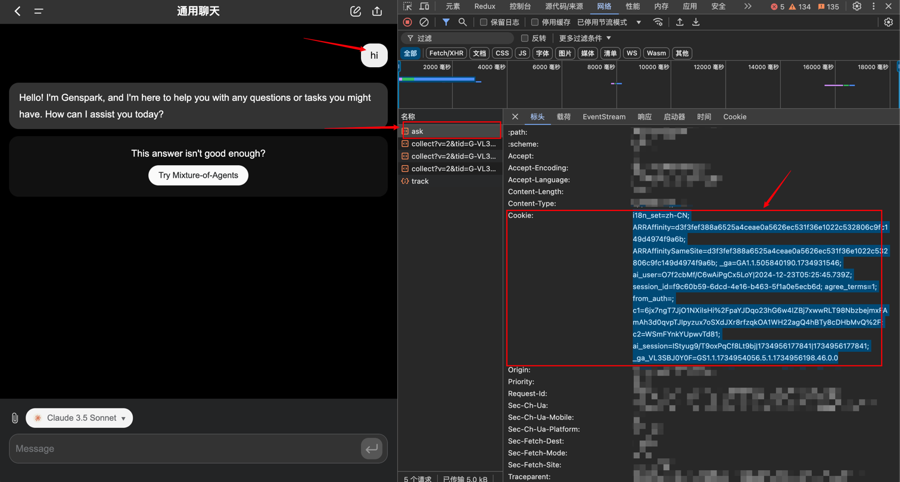
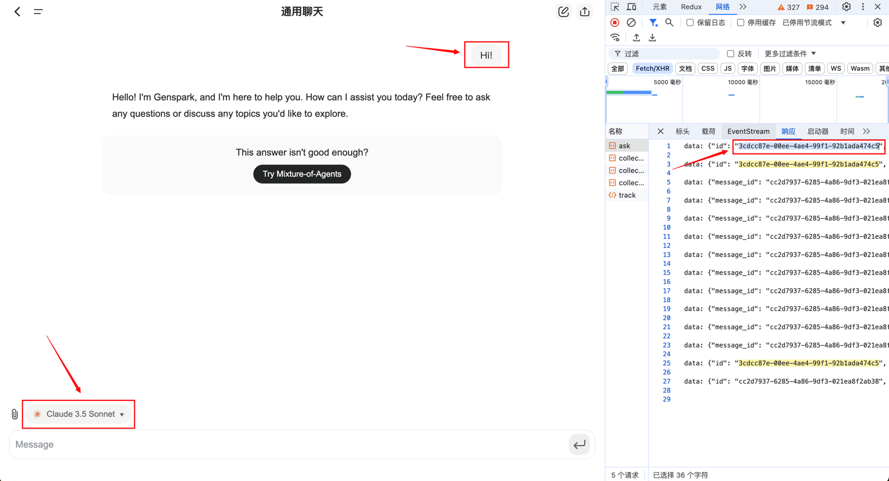

<p align="right">
   <strong>中文</strong> 
</p>

<div align="center">

# Genspark2API

_觉得有点意思的话 别忘了点个🌟_

</div>

## 功能

- [x] 支持对话接口(流式/非流式)(`/chat/completions`)(请求非以下列表的模型会触发`Mixture-of-Agents`模式)
    - **gpt-4o**
    - **gpt-4o-mini**
    - **o1-preview**
    - **claude-3-5-sonnet**
    - **claude-3-5-haiku**
    - **gemini-1.5-pro**
    - **gemini-1.5-flash**
- [x] 支持识别**图片**/**文件**多轮对话
- [x] 支持文生图接口(`/images/generations`)
    - **flux**
    - **flux-speed**
    - **flux-pro/ultra**
    - **ideogram**
    - **recraft-v3**
    - **dall-e-3**
- [x] 支持自定义请求头校验值(Authorization)
- [x] 支持cookie池(随机)
- [x] 可配置自动删除对话记录
- [x] 可配置代理请求(环境变量`PROXY_URL`)
- [x] 可配置Model绑定Chat(解决模型自动切换导致**降智**),详细请看[进阶配置](#进阶配置)。

### 接口文档:

略

### 示例:

<span></span>

## 如何使用

略

## 如何集成NextChat

填 接口地址(ip:端口/域名) 及 API-Key(`PROXY_SECRET`),其它的随便填随便选。

> 如果自己没有搭建NextChat面板,这里有个已经搭建好的可以使用 [NeatChat](https://ai.aytsao.cn/)

<span></span>

## 如何集成one-api

填 `BaseURL`(ip:端口/域名) 及 密钥(`PROXY_SECRET`),其它的随便填随便选。

<span></span>

## 部署

### 基于 Docker-Compose(All In One) 进行部署

```shell
docker-compose pull && docker-compose up -d
```

#### docker-compose.yml

```docker
version: '3.4'

services:
  genspark2api:
    image: deanxv/genspark2api:latest
    container_name: genspark2api
    restart: always
    ports:
      - "7055:7055"
    volumes:
      - ./data:/app/genspark2api/data
    environment:
      - GS_COOKIE=******  # cookie (多个请以,分隔)
      - API_SECRET=123456  # [可选]接口密钥-修改此行为请求头校验的值(多个请以,分隔)
      - TZ=Asia/Shanghai
```

### 基于 Docker 进行部署

```docker
docker run --name genspark2api -d --restart always \
-p 7055:7055 \
-v $(pwd)/data:/app/genspark2api/data \
-e GS_COOKIE=***** \
-e API_SECRET="123456" \
-e TZ=Asia/Shanghai \
deanxv/genspark2api
```

其中`API_SECRET`、`GS_COOKIE`修改为自己的。

如果上面的镜像无法拉取,可以尝试使用 GitHub 的 Docker 镜像,将上面的`deanxv/genspark2api`替换为`ghcr.io/deanxv/genspark2api`即可。

### 部署到第三方平台

<details>
<summary><strong>部署到 Zeabur</strong></summary>
<div>

> Zeabur 的服务器在国外,自动解决了网络的问题,~~同时免费的额度也足够个人使用~~

1. 首先 **fork** 一份代码。
2. 进入 [Zeabur](https://zeabur.com?referralCode=deanxv),使用github登录,进入控制台。
3. 在 Service -> Add Service,选择 Git（第一次使用需要先授权）,选择你 fork 的仓库。
4. Deploy 会自动开始,先取消。
5. 添加环境变量

   `GS_COOKIE:******`  cookie (多个请以,分隔)

   `API_SECRET:123456` [可选]接口密钥-修改此行为请求头校验的值(多个请以,分隔)(与openai-API-KEY用法一致)

保存。

6. 选择 Redeploy。

</div>


</details>

<details>
<summary><strong>部署到 Render</strong></summary>
<div>

> Render 提供免费额度,绑卡后可以进一步提升额度

Render 可以直接部署 docker 镜像,不需要 fork 仓库：[Render](https://dashboard.render.com)

</div>
</details>

## 配置

### 环境变量

1. `PORT=7055`  [可选]端口,默认为7055
2. `API_SECRET=123456`  [可选]接口密钥-修改此行为请求头(Authorization)校验的值(同API-KEY)(多个请以,分隔)
3. `GS_COOKIE=******`  cookie (多个请以,分隔)
4. `AUTO_DEL_CHAT=0`  [可选]对话完成自动删除[0:关闭,1:开启]
5. `REQUEST_RATE_LIMIT=60`  [可选]每分钟下的单ip请求速率限制,默认:60次/min
6. `PROXY_URL=http://127.0.0.1:10801`  [可选]代理
7. `MODEL_CHAT_MAP=claude-3-5-sonnet=a649******00fa,gpt-4o=su74******47hd`  [可选]Model绑定Chat(多个请以,分隔),详细请看[进阶配置](#进阶配置)

### cookie获取方式

1. 打开**F12**开发者工具。
2. 发起对话。
3. 点击ask请求，请求头中的**cookie**即为环境变量**GS_COOKIE**所需值。

> **【注】** 其中`session_id=f9c60******cb6d`是必须的，其他内容可要可不要，即环境变量`GS_COOKIE=session_id=f9c60******cb6d`




## 进阶配置

### 配置环境变量 MODEL_CHAT_MAP

> 【作用】指定对话，解决模型自动切换导致降智问题。

1. 打开**F12**开发者工具。
2. 选择需要绑定的对话的模型(示例:`claude-3-5-sonnet`),发起对话。
3. 点击ask请求，响应中的`id`即为此对话唯一id。

4. 配置环境变量 `MODEL_CHAT_MAP=claude-3-5-sonnet=3cdcc******474c5` (多个请以,分隔)


## 其他

**Genspark**(
注册领取1个月Plus): [https://www.genspark.ai](https://www.genspark.ai/invite?invite_code=YjVjMGRkYWVMZmE4YUw5MDc0TDM1ODlMZDYwMzQ4OTJlNmEx)
